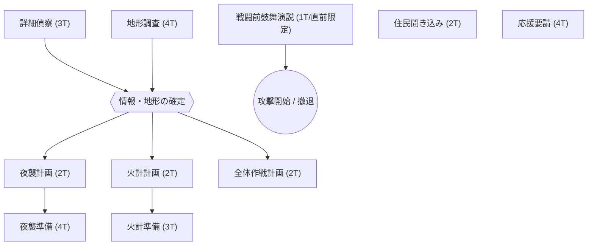

# v0.17 詳細設計書：09_ユニット戦闘システム

## 0. 本資料の目的

- 24ターンの時間軸を「準備」と「交戦」にシームレスに配分する仕組みを定義する
- プレイヤーの能力（特に統率）が戦闘結果に与える影響を強化する
- 戦闘終了後の「追撃フェーズ」への接続を明確にする
- 視覚的なレイアウト（手前・奥の概念）を定義する

---

## 1. ユニット戦闘の基本構造

### 1-1. 24ターンの時間軸
盗賊討伐の下知を受けると、専用の戦闘画面に移行する。この画面では最大24ターンが与えられる。

- **準備アクション**: 最初の数ターンを消費して実行。敵情報の開示やバフを得る。
- **実交戦**: 準備を終えた（あるいは準備を切り上げた）時点で「突撃・接敵」し、ターンベースの戦術バトルを行う。
- **追撃**: 実交戦で敵士気を0にする、あるいは敵が敗走した際に、残りのターンを使用して「討ち取り」を最大化する。

### 1-2. 能力の反映

| 能力 | 戦闘への影響 |
|------|-------------|
| **統率 (Command)** | **部隊全体のバフ・デバフ**。最大5名の前線ユニットの連携、士気の維持、交代の効率に影響。 |
| **武芸 (Combat)** | **個体ダメージ・防御力**。ユニット単体の殺傷能力と、自身の被ダメージ抑制。また、**ターゲット選択時のトドメ率**に直結する。 |
| **知略 (Intelligence)** | **偵察系アクションの効率**。詳細偵察や住民聞き込みの成功率に影響。 |
| **政務 (Administration)** | **工作系アクションの効率**。夜襲準備や地形調査の成功率に影響。 |

> [!IMPORTANT]
> **「統率」の価値向上**: v0.17では、主人公の統率が高いほど、前線ユニット全員の攻撃・防御に 統率/100 ベースのボーナスが付与される。

---

## 2. 視覚的レイアウトと操作の刷新

### 2-1. 疑似3D/レイヤー構造
UI上での「遠近感」を表現し、より臨場感を高める。

```text
[ 奥：敵勢力 ]
( ランクに応じた背景：山賊の砦 / 森 / 街道 )
- 敵前線ユニット (最大5)
- 敵控え (人数のみ表示、あるいは小アイコン)

      ↑
      | (交戦距離)
      ↓

[ 手前：自軍 ]
- 自軍前線ユニット (最大5) ：大きく表示、ステータス詳細
- 自軍控え (最大8) ：足元、または画面端に縮小表示
```

### 2-2. ターゲット選択（足裏への照準）
プレイヤーは敵前線ユニットを1体クリックして**「ターゲット」**に指定できる。

- **集中攻撃**: 主人公の武芸ダメージは指定したターゲットに優先的に適用される。
- **トドメの権利**: 主人公の攻撃によって敵のHP/士気が0（敗走）になった場合、そのユニットには**「主人公による撃破」マーク**が付与される。
- **追撃ボーナス**: 撃破マークが付いたユニットは、後の追撃フェーズにおいて**主人公の追撃効率が+30%される特権ターゲット**となる。

---

## 3. 準備フェーズとターン管理

実交戦（接敵）前の時間は、配下を活用して並列に準備を進める「マネジメント」の比重が高い。

### 3-1. 担当者の割り当てと並列実行
- **アクションの配分**: 準備アクションには「担当者（主人公、または若党）」を1名割り当てられる。
- **並列進行**: 1名につき1つのアクションを担当可能。配下の人数が多いほど、同時に多くの準備を走らせることができる。
- **配下の能力依存**: 成功率は担当者の能力（主に知略、一部武芸）に依存する。
- **ターン進行**: 「ターンを進める」ボタンを押すと1ターンが経過し、各アクションの残りターンが減少。完了時に成否結果が出る。

### 3-2. 準備アクション一覧（交戦前）

| アクション | 所要T | 主な依存能力 | 効果 |
|:---|:---:|:---:|:---|
| **詳細偵察** | 3 | 知略 | 敵情報の開示。**工作・計画の共通起点** |
| **夜襲計画** | 2 | 知略 | 解禁条件：詳細偵察＆地形調査完了。成否判定の知略参照先を決定 |
| **夜襲準備** | 4 | 政務 | 解禁条件：夜襲計画完了。夜襲攻撃の選択を可能にする |
| **地形調査** | 4 | 政務 | 追撃効率+25%。**工作・計画の前提条件** |
| **住民聞き込み**| 2 | 知略 | 初撃ダメージ+20% |
| **応援要請** | 4 | 統率 | 予備兵（臨時足軽）の追加 |
| **火計計画** | 2 | 知略 | 解禁条件：詳細偵察＆地形調査完了。成否判定の知略参照先を決定 |
| **火計準備** | 3 | 政務 | 解禁条件：火計計画完了。敵戦闘力-10%（開始5T） |
| **全体作戦計画** | 2 | 知略 | 解禁条件：詳細偵察＆地形調査完了。自軍戦闘力+10%（開始5T） |
| **戦闘前鼓舞演説**| 1 | 統率 | **攻撃開始の直前のみ・1回限定**。士気+5、攻撃力+5（開始3T） |
| **攻撃開始** | 0 | - | 後述のアタックタイプを選択 |

### 3-3. 準備ツリー（スキルツリー形式UI）
アクションの依存関係を一目で把握できるよう、UIはリスト形式ではなく**ツリー構造**で表示する。



- **視覚的表現**: 
    - 前提が未完了のアクションはグレーアウト（ロック状態）。
    - 完了したアクションは明るい色で描画され、線で繋がった次段階がアクティブになる。
    - 各ノードをクリックして担当者（主人公・若党）をアサインする。

### 3-4. 戦闘前鼓舞演説の特殊仕様
「戦闘前鼓舞演説」は、攻撃に踏み切る直前の最終宣告として扱われる。

- **実行タイミング**: 攻撃開始の直前1ターンのみ実行可能。
- **UIのロック**: 鼓舞演説を実行（担当者をアサインしてターン進行）した時点で、**他の準備アクション（並列含む）や「ターンを進める」は選択不可**となる。
- **最終選択**: 演説が完了すると、UIは「攻撃開始（通常・夜襲）」または「撤退」のみを選択できる最終フェーズへと固定される。

### 3-3. アタックタイプの選択と特殊判定
準備フェーズで「攻撃開始」を選んだ際、以下の成否および分岐が発生する。

#### A: 火計の成否判定（「火計準備」完了時のみ）
通常攻撃・夜襲攻撃問わず、「火計準備」に成功していた場合は接敵時に判定を行う。
- **実行者の知略**: 「火計計画」を担当した者の知略。未計画なら指揮官。
- **成功率**: `50% + (実行者の知略 - 敵抵抗値)`
- **成功効果**: 実交戦開始から**最初の5ターンの間、敵全部隊の戦闘力-10%**。

#### B: 全体作戦計画の成否判定（完了時のみ）
通常攻撃・夜襲攻撃問わず、「全体作戦計画」が完了している場合は接敵時に成否を判定する。
- **不実行時の処理**: 誰も計画を立てていない場合、判定自体が発生せず、バフ・デバフともになし。
- **判定の参照先**: 「全体作戦計画」を担当した者の知略。
- **成功率**: `50% + (実行者の知略 - 敵抵抗値)`
- **成功効果**: 実交戦開始から**最初の5ターンの間、自軍全部隊の戦闘力+10%**。
- **失敗時のリスク**: 計画の破綻により、自軍ユニットの**疲労が全員+10、士気-5の状態**で戦闘開始。

#### C: 戦闘前鼓舞演説の成否判定（実行時のみ）
接敵（攻撃開始）時に自動的に判定を行う。
- **実行条件**: 指揮官本人が担当していること。他アクションとの併用不可。
- **成功率**: `自身の統率 + 25` (%)
- **成功効果**: **全部隊の士気+5**、および実交戦開始から**最初の3ターンの間、攻撃力+5**。
- **失敗時のリスク**: 演説が空回りし、**士気-5、疲労+10**の状態で戦闘開始。

#### D: アタック分岐
1. **通常攻撃**: 即座に実交戦（メインバトル）に移行。
2. **夜襲攻撃**: **「夜襲準備」まで完了**している場合のみ選択可能。
    - **成否判定 (判定)**: 接敵時に以下の計算式で成否を決定する。
        - **実行者の知略**: **「夜襲計画」を担当した者の知略**。全指揮官が誰も計画を立てていない場合は指揮官本人の知略を使用。
        - **敵の抵抗値**: `(敵統率者の統率 + 敵統率者の知略) / 2 + (敵部隊の平均士気 / 5)`
        - **夜襲成功率**: `50% + (実行者の知略 - 敵の抵抗値)` (下限10%〜上限90%)
    - **効果**: 敵士気-20、自軍の先制攻撃（1ターン無報酬被弾なし）。
    - **失敗時のリスク**: 敵に察知され、自軍の士気が低下（-10）し、逆に敵から先制攻撃。

#### 夜襲成功率シミュレーション
`成功率 = 50 + (自身知略 - 敵抵抗値)` ※下限10%〜上限90%
`敵抵抗値 = (敵統率+敵知略)/2 + (敵士気/5)`

| 状況 | 自身知略 | 敵能力 (統/知/士) | 敵抵抗値 | 成功率 |
| :--- | :---: | :--- | :---: | :---: |
| **格下山賊** | 30 | 25 / 25 / 40 | 33 | **47%** |
| **標準的** | 50 | 50 / 50 / 60 | 62 | **38%** |
| **知略武将 vs 山賊** | 80 | 25 / 25 / 40 | 33 | **90%** (上限) |
| **有能 vs 有能** | 80 | 80 / 80 / 80 | 96 | **34%** |
| **不向き vs 有能** | 30 | 80 / 80 / 80 | 96 | **10%** (下限) |

---

## 4. 実交戦（メインバトル）

準備フェーズで「攻撃開始」を選択すると、実交戦ステップに移行。

### 4-1. 交戦中の基本仕様
- **スタンス選択**: 攻撃（ダメージ増/疲労増）、平常、防御（ダメージ減/疲労減）。
- **統率コマンド (NEW)**: 主人公の統率を使用し、前線のユニットに「鼓舞（士気回復）」や「死守（被ダメ大幅減）」を下す。
- **交代**: 疲労が溜まったユニットを早めに下げ、控えを出すタイミングが重要。

---

## 5. 追撃への接続

戦闘が以下の条件で終了すると、「追撃フェーズ」へ移行する。

- **勝利条件**: 敵前線の全滅、または敵全体の平均士気が0以下。
- **敗北条件**: 自軍前線の全滅、または自軍全体の平均士気が0以下（この場合、追撃は発生しない）。
- **時間切れ**: 24ターン経過。勝敗がつかない場合は「引き分け」。

### 勝利時のボーナス計算
残りのターン数（24 - 経過ターン）が多いほど、追撃の精度が上がる（＝準備不足・苦戦した場合は追撃の時間が足りない）。

```typescript
追撃残り補正 = clamp(残りターン / 12, 0.5, 1.2)
最終追撃効率 = 合計追撃効率(05_準備システム定義) × 追撃残り補正
```

## 6. 評価とランキング（功績番付）

戦闘終了時、単純な成功・失敗だけでなく、誰が最も働いたかを可視化する「功績番付」を表示する。

### 6-1. 立場別の功績評価ロジック

| 立場 | 評価軸 | ランキングのライバル | 功績への計上内容 |
| :--- | :--- | :--- | :--- |
| **徒士** (一兵卒) | **個人** | 同じ部隊の**他ユニット（徒士A, B...）** | 個人の討取数 ＋ 成功させた準備ステップ |
| **馬上衆** (中間) | **部隊/個人** | **同列の馬上衆（他小隊）** / 全個人 | [部隊] 小隊の総討取数 ＋ [個人] 自身の討取数 ＋ 準備成功 |
| **小頭** (総大将) | **軍全体** | (任務全体の成果) | 基礎数値 ＋ 軍全体の総討取数。※準備は加点対象外 |
| **ソロ/リーダー** | **任務** | (任務全体の成果) | 基礎数値 ＋ 自分(＋若党)の総討取数。※準備は加点対象外 |

### 6-2. 撃破（トドメ）の判定
- **交戦中**: 主人公がターゲット指定して0にした場合、またはランダム抽選（武芸ベース）で当選した場合。
- **追撃中**: 部隊全体の追撃数から、個人の武芸・馬・撃破マークの有無に基づき分配。

---

## 7. テスト・バランス調整項目

- [ ] 統率が低いプレイヤーが「豪華」アプローチで兵を揃えても、統率の低さ（デバフ）で苦戦するバランスになっているか。
- [ ] 24ターンをすべて準備に使うと、戦闘時間が足りなくなり「引き分け（逃げられる）」リスクが生まれているか。
- [ ] UIレイアウト変更により、敵味方の区別と戦況（どちらが押しているか）が直感的に理解できるか。
